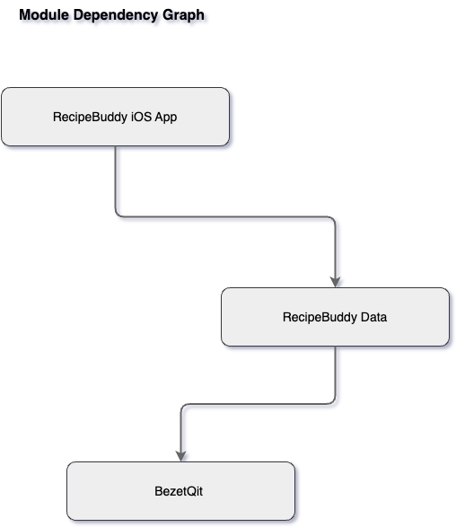
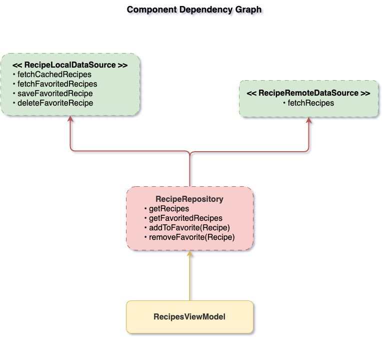

# RecipeBuddy
iOS App for browsing recipes, view details, save favorites.

## How to run
Clone repository ini dan buka projeknya dibuat menggunakan Xcode 16.4. Silakan pilih scheme Dev `Dev RecipeBuddy` atau `Prod RecipeBuddy`, lalu klik tombol run. Projek ini menggunakan `xcconfig` untuk pengaturan konfigurasi build untuk membedakan antara versi `Development` dan `Production`.

## Level Coverage
Projek ini mayoritas mencakup level 1. Projek ini menerapkan clean architecture, dependency injection pattern, repository pattern, dan SOLID principle.

## Dependency Graph
Terlampir file projek diagram dalam format `drawio` pada directory Docs.

## Third Party Dependency
Projek ini menggunakan dependency dari [BezetQit](https://github.com/danielprast/BezetQit).
